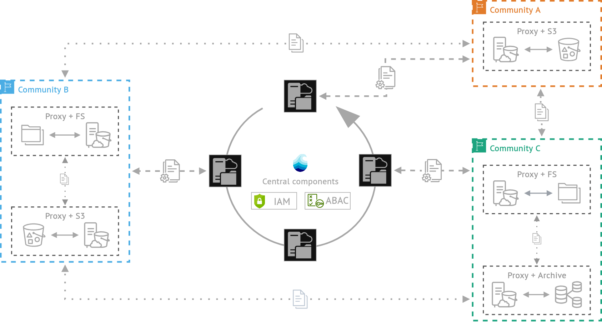

# Aruna v2 Recap

  

<!-- More Info -->

  
More Info

  Aruna is a distributed, cloud-native data orchestration engine developed in partnership of NFDI4Microbiota, NFDI4Biodiversity and the late FAIR Data Spaces project. The system provides unified access to heterogeneous data sources through an S3-compatible interface, enabling standardized data interaction across diverse storage backends and independent infrastructures. Aruna supports flexible deployment models that allow individual institutions to retain local data governance while contributing to a broader federated ecosystem. The platform includes a public search index for dataset discovery and implements automated data processing through its Hook feature, streamlining research workflows and reducing manual overhead.
  
  The system architecture consists of multiple interconnected services that work together to deliver comprehensive data orchestration capabilities. Data distribution is managed centrally while maintaining FAIR compliance principles throughout the platform. Access control operates through an Attribute Based Access Control (ABAC) system, providing granular permission management. The core infrastructure includes Aruna Server instances for management operations, Aruna Dataproxy components for data handling, Nats for asynchronous messaging between instances, Yugabyte as the distributed database foundation, and Meilisearch for maintaining the public search index across registered resources. All Aruna Server instances share a single distributed relational database that ensures consensus for write operations, maintaining ACID compliance. The current implementation supports a limited hierarchical data organization model for structuring datasets and collections.

<!--
* Distributed data, "central" management
* FAIR compliant
* Attribute Based Access Control (ABAC)
* Multiple individual services
   * Aruna Server (Management instances)
   * Aruna Dataproxy (Data instances)
   * Nats (Sync messaging between instances)
   * Yugabyte (Distributed database as common basis for management instances)
   * Meilisearch (Public search index over all registered resources)
* Single distributed relational database for Aruna Server instances
    * Consensus for every write operation (ACID compliant but performance reduction with increasing instances)
* Limited hierarchical data organization concept
-->