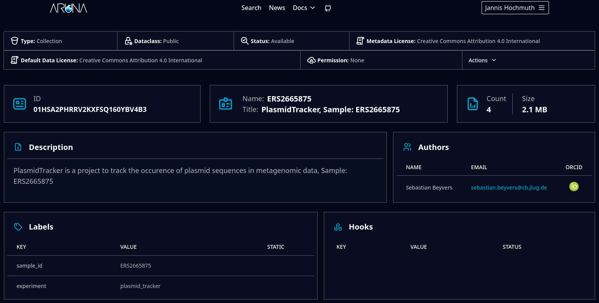

# Client interface (UI)

  

  <ul class="text-2xl" style="">
    <li>One client cross-compiled for all devices</li>
    <ul>
      <li>Realm-wide websites as an interface to all nodes</li>
      <li>Local UI for temporary, local nodes</li>
      <li>CLI tool to work with remote as well as local instances</li>
      <li>...</li>
    </ul>
    <li>Provides convenience functionality</li>
  </ul>

  

  

    

      
    

  

  
More info

  

  Similar to arunas version 2, a website is planned to lower the entry barrier for participants in
  the p2p network. Each realm can deploy a webservice, that interacts with all realm nodes, creating
  streamlined convenient interface to interact with realms. A local UI system is planned, similar to
  dropbox or torrenting managers, that help individual researchers to momentarily participate in the
  p2p network, to for example synchronize resources changes with remote nodes or share files with
  other individual researchers temporarily. To adress scripting and workflow execution, a CLI tool
  will be developed to help automate and script interactions with the p2p system.

  

