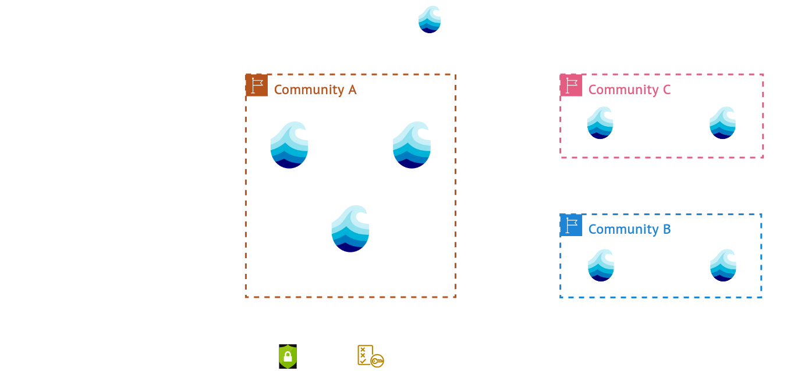

# Aruna v3

  

<!-- More Info -->

  
More Info

  Aruna v3 represents a fundamental shift from the centralized architecture of v2 to a fully federated system where nodes communicate directly without requiring central coordination components. The previous multi-service deployment model has been consolidated into a single unified service that handles all deployment scenarios, from institutional data storage proxy access to compute cluster integration and temporary personal research nodes. Close to Aruna v2's distributed management approach, each v3 node maintains responsibility solely for its own data but now intelligently forwards requests to appropriate nodes within the network if it self does not have the requested  resource. This architectural redesign expands storage backend compatibility and introduces logical compartmentalization through Realms for nodes and Groups for users, creating structured organizational layers for governance within the federated ecosystem.
  
  These changes deliver significant operational and strategic advantages for research institutions and scientific communities. The federated architecture eliminates dependency on developer-maintained central infrastructure, enabling autonomous network operation and theoretically unlimited horizontal scaling as new nodes join the federation. Participants maintain complete sovereign control over their data and infrastructure while benefiting from network-wide collaboration capabilities. The simplified single-service deployment model reduces operational complexity compared to v2's multiple interconnected components, lowering technical barriers for institutional adoption. Additionally, the Realm-based compartmentalization allows scientific domains to establish independent governance structures within the broader network, fostering discipline-specific collaboration while maintaining interoperability across the entire Aruna ecosystem.

<!--
Differences to v2:
- Fully federated system
- Single service for all deployments/use cases
- Each node only has to manage its own data
  - Support for lots of different storage backends
- Logical compartmentalization of Nodes in Realms
- Logical compartmentalization Users in Groups
- 

Benefits:
- Works independent from developers
- "Unlimited" horizontal scalability
- Partcipants retain full sovereign control over data and infrastructure
- Easier deployment compared to multiple service architecture
-->

