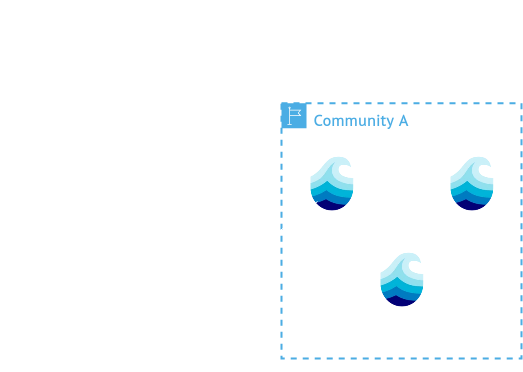

# Nodes

  

  <ul class="" style="">
    <li>Works fully autonomous</li>
    <li>Act as primary access to:</li>
    <ul>
      <li>Storage Infrastructure </li>
      <li>Compute Cluster</li>
    </ul>
    <li>Single binary with config</li>
    <li>Individuals can also participate as Node</li>
  </ul>

  

  

    

      
    

  

  
More info

  

  In a federated scientific data management system, individual nodes serve as autonomous components that collectively form a distributed research infrastructure. **Institutional Storage Gateway Nodes** provide access to large-scale research repositories, exposing datasets while maintaining local security policies. **Personal Research Nodes** represent scientists' laptops or workstations that share specialized datasets, analysis tools, or computational resources directly from personal environments. **Compute Cluster Gateway Nodes** serve as entry points to high-performance computing resources, enabling remote access to parallel processing clusters or specialized facilities. Each node maintains its own security boundaries and governance while contributing to seamless cross-institutional resource and data sharing.

  

