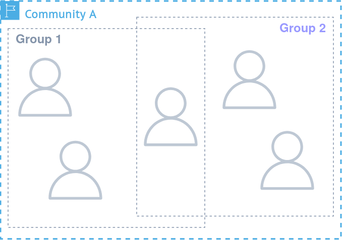

# Groups

  

  <ul class="" style="">
    <li>Form the basis of every auth-based action in a realm</li>
    <li>Organize users, resources and permissions</li>
    <li>Role-based permission handling</li>
    <li>Users can request access or can be added by group administrators</li>
    <!----
    <li>Disclaimer: Currently only predefined roles</li>
    <li>Disclaimer: Currently adding by admins</li>
    --->
  </ul>

  

  

    

      
    

  

  
More info

  

  Groups are used to organize users and permissions and form the basis of
  access-control and permission management for resources. Users can be part of one or
  multiple groups and are added by group admins or can request access to specific groups. 
  Every user can get assigned to one or more roles that represent permissions. These
  permissions can be assigned for example to only permit individual resources or allow only metdata or data management.
  This allows for a flexible, fine-grained authorization system.

  

