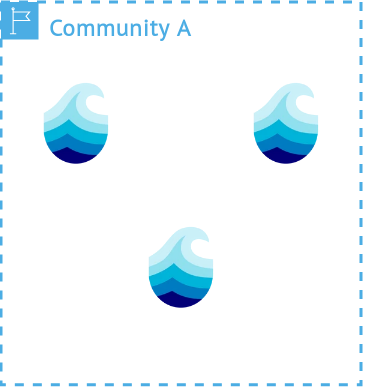

# Metadata

  

  <ul class="flex flex-col gap-12" style="">
    <li>Metadata is stored as RO-Crate</li>
    <ul>
      <li>Base metadata standard: Schema.org</li>
      <li>Uses Dublin Core term `conformsTo`</li>
    </ul>
    <li>Collaborative work on metadata is handled by CRDTs</li>
    <li>Linked meta/data relations allow for scalibility, beyond conventional databases</li>
    <li>Detailed version history for every action on metadata</li>
    <li>Every metadata object is searchable via a distributed search index in each realm</li>
    <li>Authorized distributed search of metadata contents</li>
    <!---
    <li>Disclaimer: RO-crate support not ready yet</li>
    --->
  </ul>
  

  

    

      
    

  

  
More info

  

  The basis of metadata is the json-based [RO-Crate standard](https://www.researchobject.org/ro-crate/specification/1.2/index.html).
  This means that every metadata object must adhere to the [schema.org](https://schema.org/) standard. These standards enable 
  more flexiblity on nearly every point compared to version 2. 

  This for example allows for:
  - One metadata definition collecting multiple data entries
  - One metadata definition collection other metadata definitions
  - Distributed linked metadata
  - inclusion of descriptions for non-aruna metadata links

  Collaborative editing of metadata is handled by CRDTs, allow for flexible asynchronous merging of
  changing actions. Every change results in a new version that gets collected in a version history.
  Each change not only includes the resulting action, but also the user that triggered the change,
  the node that executed the change and the realm where the action took place in.
  Because metadata can now contain metadata that is located at other nodes or even realms,
  the distribution of metadata and data becomes easier than before.
  This not only allows for much higher scaliblity than version 2, allowing for example
  the integration of massive databases inside the p2p-aruna system, but also giving researchers the
  possibility to store data on a **resilient** federated system.

  

