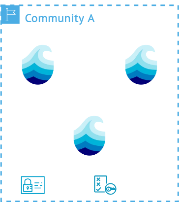

# Policies

  

  <ul class="">
    <!-- <li>Disclaimer: Unimplemented</li> -->
    <li>Basic build blocks for the different layers of trust</li>
    <li>Define which actions are allowed on which resources</li>
    <li>Can be defined realm wide or node specific</li>
    <li>Are programmatically evaluated</li>
  </ul>

  

  

    

      
    

  

  
More info

  

  Policies form the basis of autonomy for each resource and node. They define what needs to be done
  or what is permitted on specific resources and can be integrated on a resource, group, node or
  realm level. These form the building block of the different layers of trust inside a p2p network.
  Because different institutions or consortia have different constraints, a defined set of policies
  is defined for each realm. This can include replication policies for data or metadata and policies
  that deny for example specific actions for specific nodes. The resulting flexiblity allows for 
  example differentiation between higher-trust nodes, included in access-constrained compute
  environments that still can participate in a realm and the p2p network. Programmatic definition
  allows for maximum flexibility at the definition level and ensures that even complex scenarios are
  covered.

  

