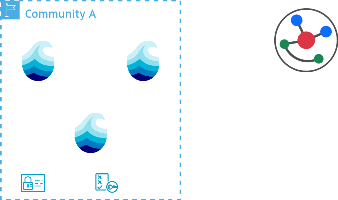

# Hooks

  

  <ul class="flex flex-col gap-12" style="">
    <!-- <li>Disclaimer: Unimplemented</li> -->
    <li>Interface to integrate external service</li>
    <li>TES compliant</li>
    <li>Triggers based on resource actions</li>
    <li>Associated with locality information</li>
    <li>Enriched with metadata context</li>
  </ul>

  

  

    

      
    

  

  
More info

  

  With hooks users can define actions that can trigger task execution of external TES services.
  Within the p2p network, specific nodes can be associated with specific compute resources, that can
  automatically trigger workflow executions. This powerful integration can efficiently route
  workflow jobs to the nearest compute resource to allow for data-to-compute patterns. Each job can
  be enriched with metadata information coming from the triggering resource action, helping to not
  only enrich metadata and data with provencance information, but also helping workflows to carry
  metadata information to external services.

  

